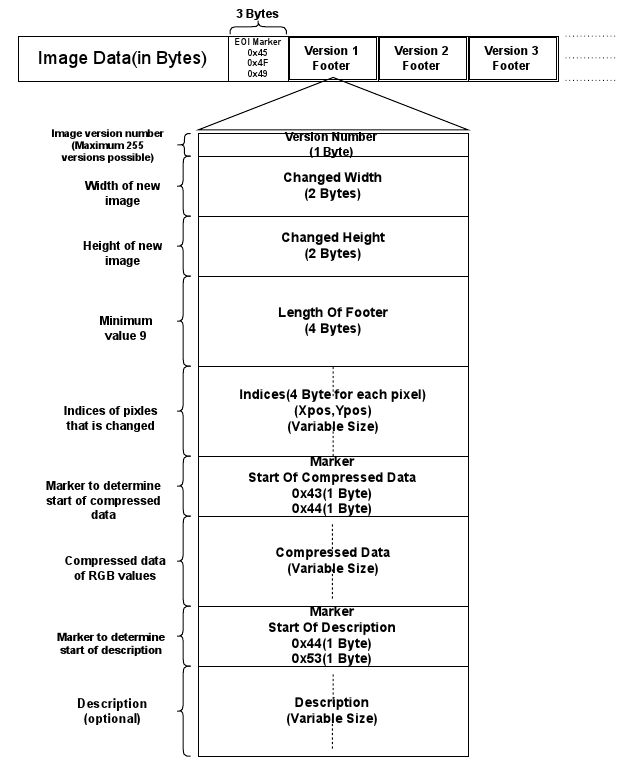

# Embedded-and-Flexible-Image-File-Version-Control-System-for-Manging-Multiple-Minor-Changes
## Abstract
With the increasing use of image as a source of information, there arises a need to efficiently process such images that results in reduced user effort as well as the storage space. This research project focuses on a way to implement version control mechanism on image data. This mechanism provides a feature where a/the user can alter any small changes in the data without modifying the original image data. A footer is formed which includes various information regarding the change made by the user in the data and that footer is appended to the original image data using compression algorithm. Similarly, the user can fetch the modified image data using decompression algorithm along with the original image data. This mechanism can be used with various base file formats such as JPG, PNG, GIF, etc. and also ensures the security of the data.

### Citation
Ankitkumar M Virparia, Yash Patel and Satyak Patel. Embedded and Flexible Image File Version Control System for Managing Multiple Minor Changes. <i>International Journal of Computer Applications 179(5):1-5, December 2017.</i>

